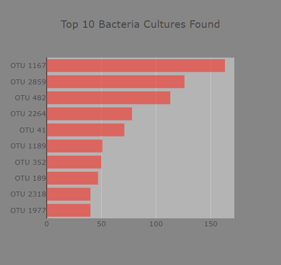
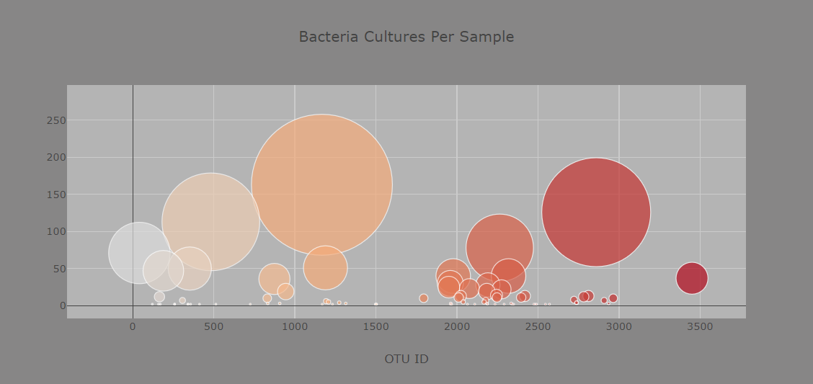
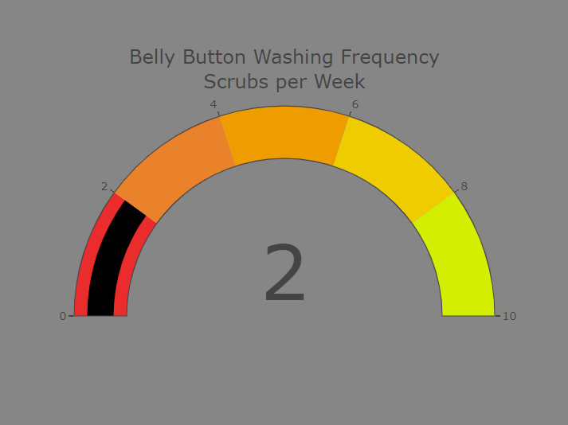

# Belly_Button_Biodiversity

## Overview
Our client Roza has a data sheet filled with numerous participants’ information regarding the bacteria samples collected from volunteer’s belly buttons. In return, the bacteria collected will assist in proving whether the current hypothesis of Improbably Beef if there is a bacteria that exists that can ultimately create a synthesized beef. The basis of the research is to see if this is true, then to determine the bacteria species type and how it can be manufactured later on. 

## Tech Used:
- HTML
- JavaScript
- CSS
- Plotly.js

## Dataset:
- Belly Button information of individual participants

## Objectives:
- Create basic plots with Plotly, including bar charts, line charts, and pie charts.
- Use D3.json() to fetch external data, such as CSV files and web APIs.
- Parse data in JSON format.
- Use functional programming in JavaScript to manipulate data.
- Use event handlers in JavaScript to add interactivity to a data visualization.
- Deploy an interactive chart to GitHub Pages.

## Purpose
While we have all of the data collected, in order to represent the results, we must construct a visual that will assist to display the results and provide comparisons on a few different factors. By creating a website, it will allow us to provide a clearer way to visually depict and layout the story that the volunteer’s bacteria samples tell us. Apart from creating the foundation of the site, we have created three chart types that allow the user to view the data of each participant, making the site interactive to all access members. 

## Results
### Bar Chart
Through the application of Javascript, a horizontal bar chart was created to display the top 10 bacterial species (OTUs) for each volunteer. By selecting the dropdown menu under ‘Test Subject ID No.:’ and selecting the ID of a participant, the graph automatically updates its display to depict the top 10 species of each individual. Participants are also able to view the ranking of the top 10 bacteria species in a descending order, to the most common one found to the least. 

### Bubbles Chart
A bubble chart was added to the site that displays the bacteria culture per sample for each individual when their ID is selected from the dropdown menu. Visually, the user is able to identify all of the bacteria cultures found per individual as well as the magnitude of how much of it was found in their belly buttons. A neat feature of this chart is the use being able to over each bubble and viewing the different labels for each sample value. 

### Gauge Chart
An important factor of the data collection apart from the bacteria is the washing frequency of the belly buttons for all volunteers. The gauge chart was created to display the weekly washing frequency values per each individual. Likewise, the gauge displays via a black line the value of washing frequency on a scale of 0-10. 

## Summary
Visualization play a strong role in effectively displaying data collected in a scenario such as volunteer results for proving or disproving a scientific research hypothesis. While the analytics is a portion of the data exploratory stage, it is significant to display the results of all the data gathered so all readers can sift through and understand in a clearer and concise way what all of the data signifies.
